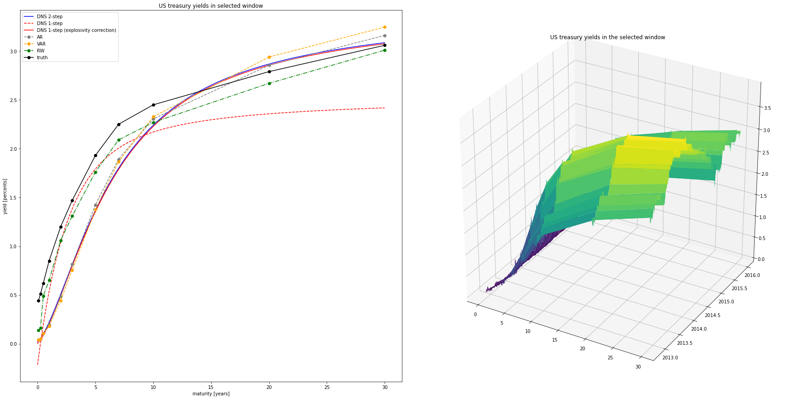

# Yield Curve Forecasting

This repository provides the implementation of the forecasting methods used in the quantitative analysis in [1]. The authors of the code are Kelly Ayliffe and Tomas Rubin.
Individuals are free to use the codes for the purpose academic research, provided it is properly acknowledged. For any other use, permission must first be arranged with the authors. Please contact us if you find errors in the code.

## Contents

- **Static Nelson-Siegel fit.ipynb**
A jupyter notebook demonstrating the fit of Nelson Siegel parametric family to (discrete) yield curve data. The user may choose the parameter lambda to play with different fits.

- **Yield curve forecasting.ipynb**
A jupyter notebook demonstrating forecasts by the considered forecasting methods in the report [1], namely the dynamic Nelson-Siegel model estimated by the one-step or two-step methods, the autoregression, the vector autoregression, and the random walk benchmark. The notebook loads the US Treasury yield curve data and allows the user to select the training window and the number of days to forecast ahead.

- **yield_curve_functions.py**
This file includes the functions for the estimation and prediction of the considered yield curve forecasting methods.

- **US_daily.xlsx**
The US Treasury yield curve data set (2011-2019).

## Contact

### Kelly Ayliffe

kelly.ayliffe@gmail.com

https://www.linkedin.com/in/kelly-ayliffe-20a24b17b/

### Tomas Rubin

tomas.rubin@gmail.com

www.tomasrubin.com

www.linkedin.com/in/tomas-rubin/

## Reference

[1] Ayliffe, Kelly and Rubin, Tomas. "A Quantitative Comparison of Yield Curve Models in the MINT Economies".

